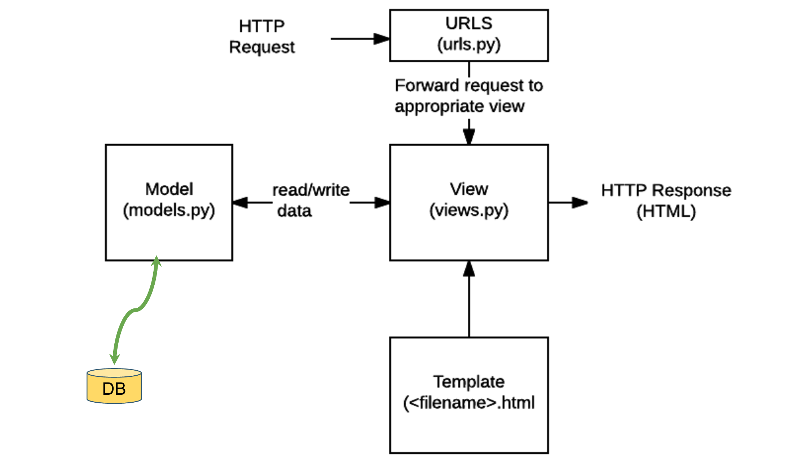
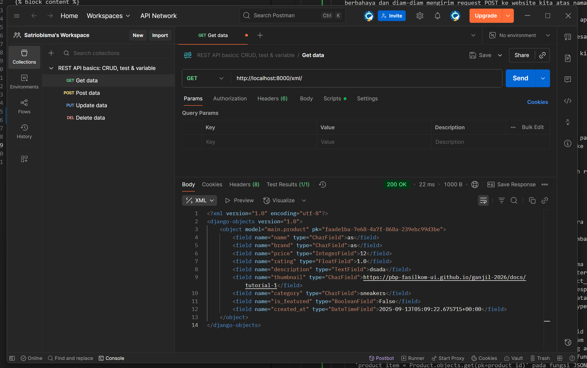

<b>Tugas 2</b>

Jelaskan bagaimana cara kamu mengimplementasikan checklist di atas secara step-by-step (bukan hanya sekadar mengikuti tutorial).
1.  Membuat sebuah proyek Django baru.
    Pertama kali buat dan jalankan virtual environment di direktori toko-sepatu-sejahtera. Lalu buat sebuah txt (requirements.txt) yang berisi hal-hal yang ingin di install, salah satunya django. Setelah itu, jalankan "django-admin startproject toko_sepatu_sejahtera" yang akan membuat proyek django baru.

2.  Membuat aplikasi dengan nama main pada proyek tersebut.
    Sama seperti sebelumnya, pertama kali buat dan jalankan virtual environment di direktori toko-sepatu-sejahtera. Lalu jalankan "python manage.py startapp main" pada direktori toko-sepatu-sejahtera. Terakhir, daftarkan aplikasi main pada settings.py dengan menambahkan 'main' pada list INSTALLED_APPS

3.  Melakukan routing pada proyek agar dapat menjalankan aplikasi main.
    Pada berkas urls.py di direktori proyek, tambahkan fungsi include di bagian impor. Lalu tambahkan "path('', include('main.urls'))", pada list urlpatterns untuk bisa menghubungkan proyek ke aplikasi main

4.  Membuat model pada aplikasi main dengan nama Product dan memiliki atribut wajib sebagai berikut.
        name sebagai nama item dengan tipe CharField.
        price sebagai harga item dengan tipe IntegerField.
        description sebagai deskripsi item dengan tipe TextField.
        thumbnail sebagai gambar item dengan tipe URLField.
        category sebagai kategori item dengan tipe CharField.
        is_featured sebagai status unggulan item dengan tipe BooleanField.
    Ketika membuat aplikasi main, otomatis juga terbuat berkas models.py. Lalu tambahkan atribut-atribut tersebut pada berkas models.py yang sudah dibuat di dalam class Product.

5.  Membuat sebuah fungsi pada views.py untuk dikembalikan ke dalam sebuah template HTML yang   
    menampilkan nama aplikasi serta nama dan kelas kamu.
    Menambahkan fungsi ini pada views.py yang akan dikirimkan ke templates main.html ketika dipanggil
    def show_info(request):
        context = {
            'app_name': 'Toko Sepatu Sejahtera',
            'name': 'Bisma Zharfan Satryo Wibowo',
            'class': 'PBP B'
        }

        return render(request, "main.html", context)

6.  Membuat sebuah routing pada urls.py aplikasi main untuk memetakan fungsi yang telah dibuat pada     
    views.py.
    Pertama buat berkas urls.py di direktori aplikasi main. Lalu tambahkan kode ini
    from django.urls import path
    from main.views import show_main

    app_name = 'main'

    urlpatterns = [
        path('', show_info, name='show_info'),
    ]
    Kode ini akan memanggil fungsi show_info di views.py jika url dengan path kosong (' ') direquest

7.  Melakukan deployment ke PWS terhadap aplikasi yang sudah dibuat sehingga nantinya dapat diakses    
    oleh teman-temanmu melalui Internet. 
    Untuk melakukan deployment ke PWS, pertama login ke website PWS terlebih dahulu. Lalu, klik create new proyek dan tulis nama tokosepatusejahtera. Simpan credentials dari proyek tersebut. Lalu, copy isi dari berkas .env.prod ke environ di proyek tersebut. Tambahkan url PWS ke list allowed_host yang ada di settings.py. Terakhir, lakukan add, commit, dan push ke PWS dan masukkan credentials yang tadi sudah disimpan.

Buatlah bagan yang berisi request client ke web aplikasi berbasis Django beserta responnya dan jelaskan pada bagan tersebut kaitan antara urls.py, views.py, models.py, dan berkas html.

Urutan alur kerja Django adalah sebagai berikut:
1.  Pengguna mengetikkan URL di browser yang akan mengirimkan HTTP request ke server web
2.  HTTP request akan diterima oleh urls.py yang akan mencocokkan dengan pola URL dengan view yang tepat
3.  View akan menjalankan logika aplikasi, jika view membutuhkan untuk menulis atau membaca data maka  
    akan melibatkan interaksi dengan Model (models.py)
4.  Setelah diproses, view akan memanggil Template yang sesuai agar bisa ditampilkan dengan lebih 
    terstruktur dan rapih dalam bentuk .html
5.  Terakhir, Django akan mengirimkan HTTP Response dalam bentuk html yang pengguna bisa lihat di 
    browser mereka
Reference: PPT 02 - Introduction to The Internet and Web Framework

Jelaskan peran settings.py dalam proyek Django!
settings.py adalah pusat konfigurasi Django yang mengatur database, aplikasi, keamanan, template, static files, middleware, dan berbagai pengaturan lain yang dibutuhkan agar proyek bisa berjalan dengan benar. Jadi setiap kali aplikasi Django dijalankan, Django akan membaca settings.py telebih dahulu untuk tahu bagaimana harus beroperasi.

Bagaimana cara kerja migrasi database di Django?
Pertama, ketika kita membuat misal class Product di Models.py, maka artinya kita ingin Django untuk membuat tabel Product dengan atribut-atributnya. Lalu, ketika kita menjalankan command "python manage.py makemigrations" setelah membuat Product di models.py, Django akan membaca perubahan pada models.py dan membuat file migration di folder migrations sesuai dengan perubahan tersebut. Setelah itu, ketika kita menjalankan "python manage.py makemigrations", Django akan mengeksekusi file migration tersebut ke database, dalam kasus ini, Django akan membuat tabel Product di database 

Menurut Anda, dari semua framework yang ada, mengapa framework Django dijadikan permulaan pembelajaran pengembangan perangkat lunak?
Menurut saya, Django dipilih menjadi framework untuk permulaan pembelajaran ini, karena penggunaan bahasa Python yang menjadikannya lebih mudah dimengerti. Selain itu Django juga sudah lengkap dari awal dengan banyak fitur bawaan. Django juga dipilih, karena lebih terstruktur, aman, didukung komunitas besar, dan tetap relevan di industri.

Apakah ada feedback untuk asisten dosen tutorial 1 yang telah kamu kerjakan sebelumnya?
Kalau dari saya, tidak ada, karena dari web tutorial nya sudah sangat jelas dari step-by-step nya, lalu asisten dosennya pun selalu ada buat ngebantu kita kalo ada yang bermasalah. 

<b>Tugas 3</b>

 Jelaskan mengapa kita memerlukan data delivery dalam pengimplementasian sebuah platform?
 Data Delivery dibutuhkan dalam sebuah platform untuk 
    1. Memungkinkan adanya interaksi antar komponen, yaitu dengan data delivery, komponen-komponen pada platform bisa saling bertukar informasi, misal dari frontend ke backend dan begitupun sebaliknya
    2. Menambah user experience, yaitu data delivery memungkinkan respon kepada pengguna dengan cepat dan data yang juga up-to-date
    3. Menjamin konsistensi data antar setiap komponen pada platform sehingga tidak ada data pada platform yang keliru
    4. Platform bisa terhubung ke layanan eksternal dengan mengirimkan data lintas sistem yang juga bisa menambah user experience
    5. Dengan data delivery, memungkinkan data atau informasi yang dikirimkan tidak hanya cepat sampai, tetapi juga aman dan andal

Menurutmu, mana yang lebih baik antara XML dan JSON? Mengapa JSON lebih populer dibandingkan XML?
XML dan JSON memiliki keunggulan dan kelemahannya masing-masing. Format XML lebih baik jika data membutuhkan struktur yang lebih kompleks, metadata, atau standar formal (contoh: dokumen hukum, konfigurasi enterprise, SOAP). Sedangkan JSON lebih baik untuk digunakan pada aplikasi web/mobile modern, API, atau sistem yang butuh kecepatan dan efisiensi. JSON lebih populer dikarenakan itu, 
    1. Lebih cepat dan ringan
    2. Mudah dibaca dan ditulis karena mirip dengan struktur data javascript
    3. Dapat integrasi langsung dengan javascript
    4. Didukung luas di API modern
    5. Lebih efisien untuk pertukaran data

Jelaskan fungsi dari method is_valid() pada form Django dan mengapa kita membutuhkan method tersebut?
Method is_valide() digunakan untuk memvalidasi data yang diinput user, seperti:
    1. Memeriksa apakah semua field yang diinput sudah sesuai, contohnya 'IntegerField(min_value=1)' yang jika tidak sesuai maka method akan mengembalikan false
    2. Menjalankan validasi built-in maupun custom, seperti email harus valid dan angka sesuai dengan range
    3. Mengisi 'cleaned_data' jika valid , yaitu jika form valid, 'form.cleaned_data' akan berisi data yang sudah dibersihkan dan siap dipakai (misalnya disimpan ke database).
Kita membutuhkan method tersebut untuk keamanan, yaitu agar input dari user dicek terlebih dahulu sebelum diproses. Selain itu, method ini juga dibutuhkan untuk memastikan data yang masuk sudah sesuai format. Terakhir, dengan adanya method ini memudahkan kita sebagai developer untuk memvalidasi input, tanpa mulai dari 0

Mengapa kita membutuhkan 'csrf_token' saat membuat form di Django? Apa yang dapat terjadi jika kita tidak menambahkan 'csrf_token' pada form Django? Bagaimana hal tersebut dapat dimanfaatkan oleh penyerang?
Fungsi utama dari 'csrf_token' adalah untuk memastikan bahwa request POST (misalnya ketika login ke akun) benar-benar pengguna sah yang menggunakan website kita, bukan pihak dari website lain yang menyamar. Jika kita tidak menambahkan 'csrf_token', maka aplikasi menjadi:
    1. Menjadi rentan terhadap serangan csrf, yaitu penyerang dapat membuat website yang berbahaya dan diam-diam mengirim request POST ke website kita atas nama pengguna yang ingin login
    2. Tidak mempunyai validasi keaslian request, server tidak bisa tahu apakah request POST datang dari form asli di website kita atau dari pihak ketiga.
    3. Menambah resiko manipulasi data, misalnya: ubah password, kirim pesan, bahkan transfer saldo bisa dilakukan tanpa sepengetahuan user.
Penyerang dapat memanfaatkan hal ini dengan membuat website palsu (misal kita login ke bank.com (sudah ada session/cookie yang aktif))
    '<html>
        <body onload="document.forms[0].submit()">
            <form action="https://bank.com/transfer" method="POST">
            <input type="hidden" name="to_account" value="hacker123">
            <input type="hidden" name="amount" value="1000000">
            </form>
        </body>
    </html>'
Kalau kita (yang sedang login di bank.com) tanpa sadar mengunjungi situs palsu itu:
    1. Browser otomatis mengirim cookie session bank.com + request POST ke server bank.com.
    2. Server mengira itu request sah dari kita.
    3. Uang kita bisa ditransfer ke akun penyerang tanpa kita tahu.
Dengan csrf_token, serangan ini gagal, karena server akan mengecek apakah request berisi token valid. Situs palsu tidak bisa menebak token unik tersebut.

 Jelaskan bagaimana cara kamu mengimplementasikan checklist di atas secara step-by-step (bukan hanya sekadar mengikuti tutorial).
    1. Tambahkan 4 fungsi views baru untuk melihat objek yang sudah ditambahkan dalam format XML, JSON, XML by ID, dan JSON by ID.
       Fungsi untuk melihat semua data yang sudah ditambahkan:
       Membuat dua fungsi baru yang menerima parameter request dengan nama 'show_xml' dan 'show_json', serta membuat sebuah variabel di dalam kedua fungsi tersebut yang menyimpan hasil query dari seluruh data yang ada pada Product, yaitu 'product_list = Product.objects.all()'. Lalu, Tambahkan return function yang berupa HttpResponse yang berisi parameter data hasil query yang sudah diserialisasi menjadi JSON atau XML dan parameter 'content_type="application/json"' pada fungsi json dan 'content_type="application/xml"' pada fungsi XML
       Fungsi untuk melihat data sesuai id yang diinginkan:
       Membuat dua fungsi baru yang menerima parameter request dan news_id dengan nama show_xml_by_id dan show_json_by_id, serta membuat variabel di dalam kedua fungsi tersebut yang menyimpan hasil hasil query dari data dengan id tertentu yang ada pada Product, yaitu 'product_item = Product.objects.filter(pk=product_id)'pada fungsi XML dan 'product_item = Product.objects.get(pk=product_id)' pada fungsi JSON. Lalu tambahkan return function berupa HttpResponse yang berisi parameter data hasil query yang sudah diserialisasi menjadi JSON atau XML dan parameter content_type dengan value "application/xml" (untuk format XML) atau "application/json" (untuk format JSON). Setelah itu, tambahkan try except pada kedua fungsi untuk ketika id tidak ditemukan.
       Terakhir untuk keempat fungsi tambahkan juga import semua fungsi pada urls.py dan buat pathnya masing-masing

    2. Membuat routing URL untuk masing-masing views yang telah ditambahkan pada poin 1.
       Setelah membuat keempat fungsi, maka pertama import dulu semua fungsi tersebut ke urls.py pada direktori main. Setelah itu buat path setiap fungsi, yaitu
        - path('xml/', show_xml, name='show_xml'), untuk fungsi menampilkan semua dengan format XML
        - path('json/', show_json, name='show_json'), untuk fungsi menampilkan semua dengan format JSON
        - path('xml/<str:product_id>/', show_xml_by_id, name='show_xml_by_id'), untuk fungsi menampilkan sesuai id dengan format XML
        - path('json/<str:product_id>/', show_json_by_id, name='show_json_by_id'),untuk fungsi menampilkan sesuai id dengan format JSON

    3. Membuat halaman yang menampilkan data objek model yang memiliki tombol "Add" yang akan redirect ke halaman   
    form, serta tombol "Detail" pada setiap data objek model yang akan menampilkan halaman detail objek.
    Pertama buatlah di dalam block <a> sebuah button add product yang memindahkan ke url create_product.html. Dibawahnya buat sebuah blok if jika di dalam product_list masih kosong. Dibawahnya, di dalam blok else dari if sebelumnya, buat blok looping untuk semua produk yang sudah dibuat. Untuk setiap produknya, pertama tampilkan nama produknya dan hubungkan juga ke product_detail.html. Dibawahnya tampilkan thumbnail juga jika produk memilikinya. Terakhir tambahkan tombol more yang juga dihubungkan ke product_detail.html

    4. Membuat halaman form untuk menambahkan objek model pada app sebelumnya.
    Di dalam blok template base.html, buat sebuah form dengan method POST. Buat table setelahnya berdasarkan atribut-atribut dari product. Terakhir tambahkan input yang menambah produk ke product_list.

    5. Membuat halaman yang menampilkan detail dari setiap data objek model.
       Di dalam blok template base.html, pertama buat button back to product list yang mengembalikan ke halaman utama. Dibawahnya tampilkan product_name dan atribut-atribut lainnya, seperti jika dia is_featured, price, rating, brand, dan juga kapan produknya ditambahkan. Dibawahnya tampilkan juga thumbnail, jika produk memilikinya. Terakhir buat blok paragraf untuk menyimpan product.description

Mengakses keempat URL di poin 2 menggunakan Postman, membuat screenshot dari hasil akses URL pada Postman, dan menambahkannya ke dalam README.md.

